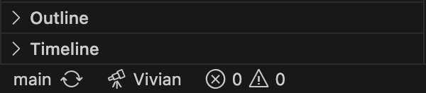
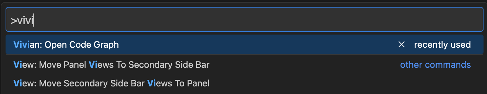

# Vivian 

Vivian is an intelligent code analysis tool designed to visualize the codebase as an interactive graph, making it easier for both developers and AI agents to read, follow, and understand code structure. While it includes vulnerability management capabilities, its primary focus is on structural visualization and agentic interaction. It consists of a VS Code extension (Client) and a Python backend service (Server).

## Inspiration
We wanted to solve the problem of navigating and understanding complex, large-scale codebases. Traditional file explorers don't show how everything connects, and standard AI coding assistants often lack deep structural context. We envisioned a tool that visually maps out your entire workspace and pairs it with an intelligent, agent-based AI to analyze architecture and detect vulnerabilities seamlessly.

- **The Cursor Approach (Text Search):** When you point tools like Cursor at a folder, they open every file and read the raw text. They chop all that text into small paragraphs and save them into a hidden search database. When you ask a question, it simply runs a massive, smart keyword search across those chopped-up text blocks to find the closest match. This approach completely loses the "big picture" architecture.

- **The Antigravity Approach (Summary Notes):** Other tools look at how your directories are organized. They read the files inside each folder and write plain-English summaries about what that specific folder does. Meaning auto-generating a giant "table of contents" for your whole project. When you ask a question, it reads its own summaries to figure out which folder has the answer. This is often too high-level and misses granular function-to-function dependencies.

- **The Vivian Approach (Graph Architecture):** We realized that code is inherently relational, not just a collection of text documents. Vivian solves this by mapping out the actual structural relationships between files, classes, and functions. Instead of brute-forcing context by stuffing massive chunks of raw text into a prompt (which is highly token-inefficient) or relying on vague folder summaries, Vivian feeds our AI agent an optimized structural graph. This makes our method dramatically more token-efficient, faster, and cheaper, while giving the AI a native understanding of how your entire architecture connects.

## Demo
*[Watch the Demonstration Video](https://youtu.be/JRHTtBRxPOg)*

## What it does
Vivian is an interactive VS Code extension that turns your codebase into a living, visual map:
*   **Structural Analysis:** It maps out and displays the intricate relationships between files, classes, and functions across your entire workspace.
*   **Intuitive UI:** It visualizes this data as an interactive graph, making it incredibly easy to track dependencies and follow code logic.
*   **Integrated AI Chatbot:** Users can chat with an AI assistant that natively understands the graph structure, allowing for deep, context-aware codebase analysis.
*   **Security Scanning:** It directly scans files and Git commit histories to detect vulnerabilities and potential security flaws right within the editor.
*   **Supported Languages:** Out-of-the-box support for `TypeScript/JavaScript`, `Python`, `Go`, `Rust`, `Java`, and `C/C++/C#`.

## How we built it
We built Vivian using a modern, multi-layered tech stack:
*   **VS Code Extension:** Built with TypeScript and the VS Code API for seamless editor integration.
*   **Graph Display:** We used D3.js to render the interactive, force-directed code relationship graphs.
*   **AI Backend:** A robust Python backend powered by FastAPI and WebSockets for real-time communication.
*   **Agents:** We utilized LangGraph to orchestrate our AI agents.
*   **LLM:** Powered by the Google Gemini API to handle deep reasoning and codebase analysis.

## What's next for Vivian
*   **Deeper Responses:** Currently, chatbot responses can sometimes be fragmented or lack depth. We plan to improve the agent's reasoning to provide much more comprehensive and detailed answers.
*   **Scaling to Legacy Projects:** Our current testing has been on relatively small scopes. We need to optimize Vivian to handle massive, legacy enterprise codebases without performance bottlenecks.
*   **Simplified Prompting:** Right now, users sometimes have to provide a lot of manual context in their prompts. We want to automate context-gathering so the prompting experience is frictionless.
*   **UI/UX Polish:** We will continue to refine and simplify the user interface to make the graph navigation and chat experience as intuitive as possible.

## Prerequisites

Before running the setup scripts, please ensure you have the following installed on your machine:
- [Node.js](https://nodejs.org/) (required to build the VS Code extension)
- [Python 3.8+](https://www.python.org/downloads/) (required for the backend server)

## Installation and Setup

The easiest way to build the extension and install the required Python dependencies is to use the provided setup scripts. These scripts will automatically install the Node dependencies, package the VS Code extension, and create the Python virtual environment for the backend server.

**For Mac/Linux:**
Double-click the `setup.command` file in Finder, or run `./setup.command` from your terminal.

**For Windows:**
Double-click the `setup.bat` file in Explorer.

Once the script finishes:
1. Open the Extensions view in VS Code (`Cmd+Shift+X` or `Ctrl+Shift+X`).
2. Click the `...` (Views and More Actions) button at the top right of the Extensions panel.
3. Select **Install from VSIX...**
4. Choose the newly generated `vivian-1.0.0.vsix` file located in your project root directory.

## How to Use
Once the extension is installed, you can launch the Vivian interactive graph in two ways:

1. **Status Bar Button:** Click the **Vivian** button located in:
   - The bottom-left status bar of your VS Code window.
     
     
   - The top right in explorer view.
     

2. **Command Palette:** If you don't see the button, open the Command Palette (`Cmd+Shift+P` on Mac or `Ctrl+Shift+P` on Windows), type **Vivian**, and select **Vivian: Open Graph**.
   

## Project Structure
```text
Vivian/
├── Client/                 # VS Code Extension (TypeScript)
│   ├── src/                # Extension source code
│   └── package.json        # Extension manifest and dependencies
│
├── Server/                 # Python Backend (FastAPI / WebSockets)
│   ├── core/               # Core business logic and LLM agents
│   ├── handlers/           # Request and WebSocket handlers
│   ├── main.py             # Server entry point
│   └── requirements.txt    # Python dependencies
│
└── README.md
```
